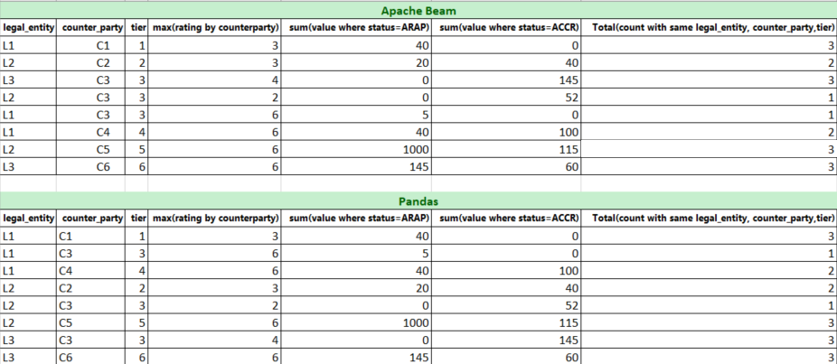

# Assignment from Hartree Partners

## Requirement
Please do same exercise using two different framework.

Framework 1. pandas
framework 2. apache beam python https://beam.apache.org/documentation/sdks/python/

using two input files dataset1 and dataset2 

join dataset1 with dataset2 and get tier

generate below output file

legal_entity, counterparty, tier, max(rating by counterparty), sum(value where status=ARAP), sum(value where status=ACCR)

Also create new record to add total for each of legal entity, counterparty & tier.

Sample data:
legal_entity, counterparty, tier, max(rating by counterparty), sum(value where status=ARAP), sum(value where status=ACCR)
L1,Total, Total, calculated_value, calculated_value,calculated_value
L1, C1, Total,calculated_value, calculated_value,calculated_value
Total,C1,Total,calculated_value, calculated_value,calculated_value
Total,Total,1,calculated_value, calculated_value,calculated_value
L2,Total,Total,calculated_value, calculated_value,calculated_value
....
like all other values.

where caluclated_value in sample data needs to be calculated using above method.

## Setup
1. Create a virtual environment: `python -m .venv venv`
2. Activate this virtual environment: `.venv\Scripts\activate`
3. Install requirements: `python -m pip install -r .\requirements.txt`

## Pandas solution
There are 2 solutions:
1. Run `python .\hartree_pandas.py`
2. Launch Jupyter Notebook `hartree_pandas.ipynb` and run each step one by one

## Apache Beam solution
There are 2 solutions:
1. Run `python .\hartree_beam.py`
2. Launch Jupyter Notebook `hartree_beam.ipynb` and run each step one by one

The output of both solutions matches in terms of schema and records, although the sorting is not same.

